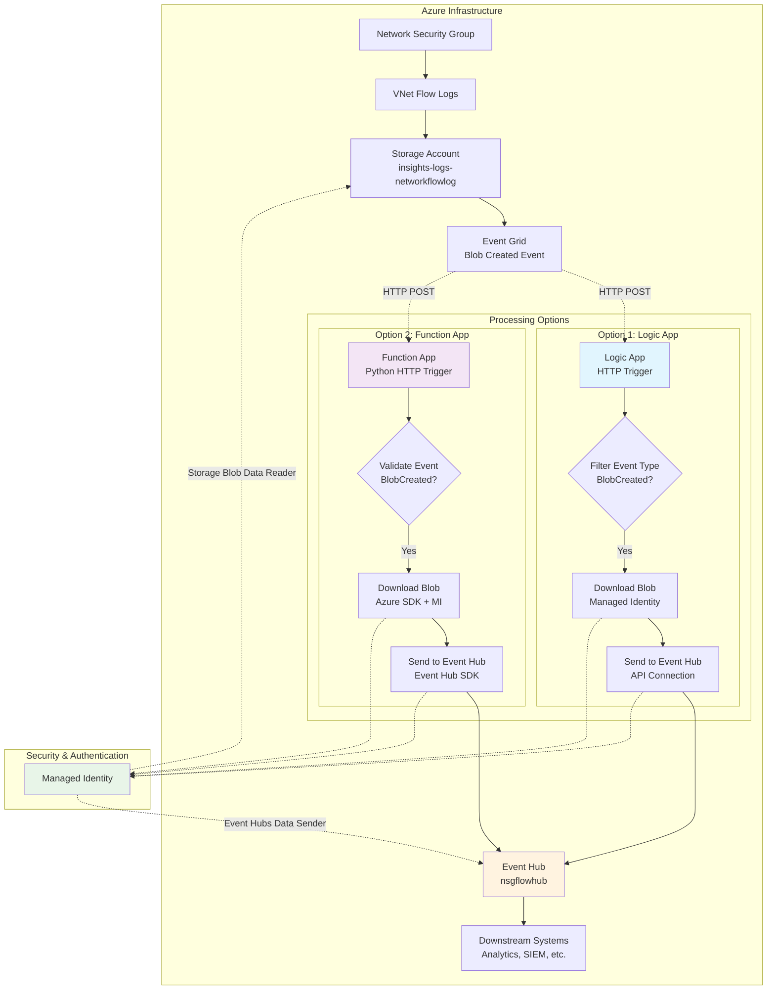
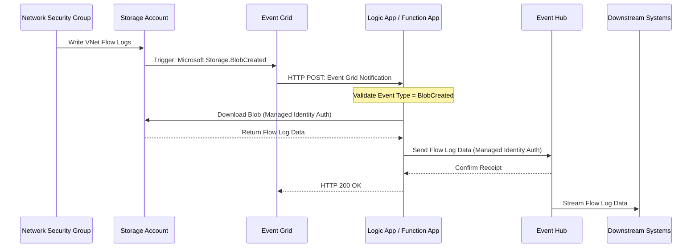

# VNet Flow Logs to Event Hub

This repository provides **two implementation approaches** for processing VNet flow logs and forwarding them to an Event Hub for analysis:

1. **Logic App Version** - Visual workflow designer approach
2. **Function App Version** - Code-based Python implementation ⭐ **NEW**

## Implementation Comparison

| Feature | Logic App | Function App |
|---------|-----------|--------------|
| **Best For** | Quick setup, visual workflows | High performance, custom logic |
| **Performance** | Good | Excellent |
| **Cost** | Connector + execution fees | Consumption-based |
| **Flexibility** | Pre-built actions | Full code control |
| **Monitoring** | Workflow runs | Application Insights |
| **Setup Time** | Fast (visual designer) | Moderate (code deployment) |

## Architecture

Both approaches implement the same processing pipeline with different execution environments:



### Data Flow Sequence



## Files Structure

```
├── logicapp/                    # Logic App implementation
│   ├── workflow-consumption.json   # For Consumption Logic Apps
│   ├── workflow-standard.json      # For Standard Logic Apps  
│   └── README.md                   # Logic App documentation
├── function-app/                # Function App implementation ⭐ NEW
│   ├── __init__.py                 # Python function code
│   ├── function.json               # Function configuration
│   ├── requirements.txt            # Dependencies
│   └── README.md                   # Function App documentation
├── scripts/                     # Deployment and testing scripts
│   ├── setup-infrastructure.sh     # Core Azure resources
│   ├── configure-managed-identity.sh # Logic App RBAC
│   ├── test-upload.sh              # Logic App testing
│   ├── deploy-function-app.sh      # Function App deployment ⭐ NEW
│   ├── configure-function-rbac.sh  # Function App RBAC ⭐ NEW
│   └── test-function.sh            # Function App testing ⭐ NEW
└── CONFIGURATION.md             # Setup guide

## Quick Start

### Option 1: Logic App (Visual Workflow)
1. **Deploy Infrastructure**: Run `scripts/setup-infrastructure.sh`
2. **Configure RBAC**: Run `scripts/configure-managed-identity.sh`  
3. **Import Workflow**: Deploy appropriate workflow JSON to Logic App
4. **⚠️ IMPORTANT**: Follow `CONFIGURATION.md` for required manual setup steps
5. **Test**: Configure and run `scripts/test-upload.sh`

### Option 2: Function App (Python Code) ⭐ **NEW**
1. **Deploy Infrastructure**: Run `scripts/setup-infrastructure.sh` (same base resources)
2. **Deploy Function**: Run `scripts/deploy-function-app.sh`
3. **Configure RBAC**: Run `scripts/configure-function-rbac.sh`
4. **Test**: Configure and run `scripts/test-function.sh`

## Recommendations

- **Choose Logic App** for quick setup, visual design, and integration scenarios
- **Choose Function App** for high-volume processing, custom logic, or cost optimization

## Manual Configuration Required

After running the setup scripts, you **must** manually configure the Event Hub connection in the Logic App. See `CONFIGURATION.md` for detailed steps - the Logic App will not work without this manual configuration.

## Deployment

1. Deploy the Logic App workflow using the Azure portal or ARM templates
2. Configure the Event Hub connection
3. Set up Event Grid subscriptions to trigger the workflow

## Testing

Use the test script in the `scripts/` folder to simulate storage events and verify the workflow functionality.