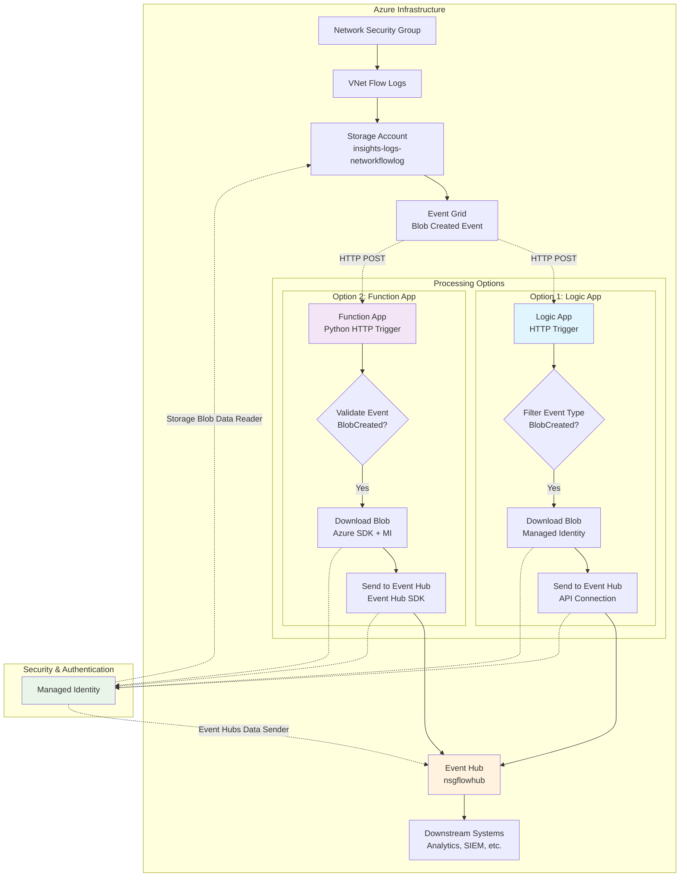
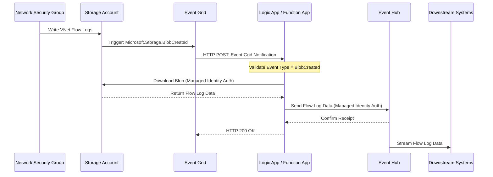

# VNet Flow Logs to Event Hub

> **Process and forward Azure VNet flow logs to Event Hub for real-time analysis**

This repository provides **two production-ready implementation approaches** for processing VNet flow logs and forwarding them to an Event Hub:

1. **Logic App** - Visual workflow designer approach
2. **Function App** - Code-based Python implementation

## 🚀 Implementation Comparison

| Feature | Logic App | Function App |
|---------|-----------|--------------|
| **Best For** | Quick setup, visual workflows | High performance, custom logic |
| **Performance** | Good | Excellent |
| **Cost** | Connector + execution fees | Consumption-based |
| **Flexibility** | Pre-built actions | Full code control |
| **Monitoring** | Workflow runs | Application Insights |
| **Setup Time** | Fast (visual designer) | Moderate (code deployment) |

## 📐 Architecture

Both approaches implement the same processing pipeline with different execution environments:


```mermaid
graph TB
    subgraph "Azure Infrastructure"
        NSG[Network Security Group] --> FL[VNet Flow Logs]
        FL --> SA[Storage Account<br/>insights-logs-networkflowlog]
        SA --> EG[Event Grid<br/>Blob Created Event]
        
        subgraph "Processing Options"
            subgraph "Option 1: Logic App"
                LA[Logic App<br/>HTTP Trigger]
                LA --> LAC{Filter Event Type<br/>BlobCreated?}
                LAC -->|Yes| LAD[Download Blob<br/>Managed Identity]
                LAD --> LAE[Send to Event Hub<br/>API Connection]
            end
            
            subgraph "Option 2: Function App"
                FA[Function App<br/>Python HTTP Trigger]
                FA --> FAC{Validate Event<br/>BlobCreated?}
                FAC -->|Yes| FAD[Download Blob<br/>Azure SDK + MI]
                FAD --> FAE[Send to Event Hub<br/>Event Hub SDK]
            end
        end
        
        EG -.->|HTTP POST| LA
        EG -.->|HTTP POST| FA
        LAE --> EH[Event Hub<br/>nsgflowhub]
        FAE --> EH
        
        EH --> DS[Downstream Systems<br/>Analytics, SIEM, etc.]
    end
    
    subgraph "Security & Authentication"
        MI[Managed Identity]
        MI -.->|Storage Blob Data Reader| SA
        MI -.->|Event Hubs Data Sender| EH
        LAD -.-> MI
        FAD -.-> MI
        LAE -.-> MI
        FAE -.-> MI
    end

    style LA fill:#e1f5fe
    style FA fill:#f3e5f5
    style MI fill:#e8f5e8
    style EH fill:#fff3e0
```

### 🔄 Data Flow Sequence


```mermaid
sequenceDiagram
    participant NSG as Network Security Group
    participant SA as Storage Account
    participant EG as Event Grid
    participant APP as Logic App / Function App
    participant EH as Event Hub
    participant DS as Downstream Systems

    NSG->>SA: Write VNet Flow Logs
    SA->>EG: Trigger: Microsoft.Storage.BlobCreated
    EG->>APP: HTTP POST: Event Grid Notification
    
    Note over APP: Validate Event Type = BlobCreated
    
    APP->>SA: Download Blob (Managed Identity Auth)
    SA-->>APP: Return Flow Log Data
    APP->>EH: Send Flow Log Data (Managed Identity Auth)
    EH-->>APP: Confirm Receipt
    APP-->>EG: HTTP 200 OK
    
    EH->>DS: Stream Flow Log Data
```

## 📁 Project Structure

```
├── logicapp/                         # Logic App implementation
│   ├── workflow-consumption.json        # For Consumption Logic Apps
│   ├── workflow-standard.json           # For Standard Logic Apps  
│   └── README.md                        # Logic App documentation
├── function-app/                     # Function App implementation
│   ├── __init__.py                      # Python function code
│   ├── function.json                    # Function configuration
│   ├── host.json                        # Function host configuration
│   ├── requirements.txt                 # Python dependencies
│   └── README.md                        # Function App documentation
├── scripts/                          # Deployment and testing scripts
│   ├── setup-infrastructure.sh          # Core Azure resources
│   ├── configure-managed-identity.sh    # Logic App RBAC
│   ├── test-upload.sh                   # Logic App testing
│   ├── deploy-function-app.sh           # Function App deployment
│   ├── configure-function-rbac.sh       # Function App RBAC
│   └── test-function.sh                 # Function App testing
└── CONFIGURATION.md                  # Detailed setup guide

## ⚡ Quick Start

### Option 1: Logic App (Visual Workflow)

1. **Deploy Infrastructure**
   ```bash
   ./scripts/setup-infrastructure.sh
   ```

2. **Configure RBAC**
   ```bash
   ./scripts/configure-managed-identity.sh
   ```

3. **Import Workflow**
   - Deploy appropriate workflow JSON to Logic App via Azure Portal

4. **⚠️ Manual Configuration Required**
   - Follow `CONFIGURATION.md` for Event Hub connection setup

5. **Test**
   ```bash
   ./scripts/test-upload.sh
   ```

### Option 2: Function App (Python Code)

1. **Deploy Infrastructure** (if not already deployed)
   ```bash
   ./scripts/setup-infrastructure.sh
   ```

2. **Deploy Function App**
   ```bash
   ./scripts/deploy-function-app.sh
   ```

3. **Configure RBAC**
   ```bash
   ./scripts/configure-function-rbac.sh
   ```

4. **Test**
   ```bash
   ./scripts/test-function.sh
   ```

## 💡 Recommendations

| Choose Logic App When... | Choose Function App When... |
|--------------------------|------------------------------|
| You need quick setup with minimal code | You need high-volume processing |
| You prefer visual workflow design | You want full code control |
| You're building integration scenarios | You need cost optimization |
| Your team is less developer-focused | You require custom business logic |

## 🔒 Security Features

- **Managed Identity** - No credentials in code
- **RBAC** - Principle of least privilege
- **TLS 1.2+** - Encryption in transit
- **Shared Key Disabled** - Enhanced storage security
- **Private Endpoints Ready** - VNet integration support

## 📝 Prerequisites

- Azure subscription
- Azure CLI installed and authenticated
- Bash shell (Linux, macOS, WSL, or Azure Cloud Shell)
- For Function App: Azure Functions Core Tools

## 🧪 Testing

Both implementations include test scripts that:
- Upload a sample flow log to storage
- Simulate Event Grid notifications
- Verify end-to-end processing

See individual test scripts for configuration requirements.

## 📚 Documentation

- **[CONFIGURATION.md](CONFIGURATION.md)** - Detailed setup and configuration guide
- **[function-app/README.md](function-app/README.md)** - Function App specific documentation
- **[logicapp/README.md](logicapp/README.md)** - Logic App specific documentation

## 🤝 Contributing

Contributions are welcome! Please feel free to submit issues or pull requests.

## 📄 License

This project is provided as-is for educational and reference purposes.

---

<div align="center">

**Built with ❤️ following Azure Well-Architected Framework best practices**

</div>
